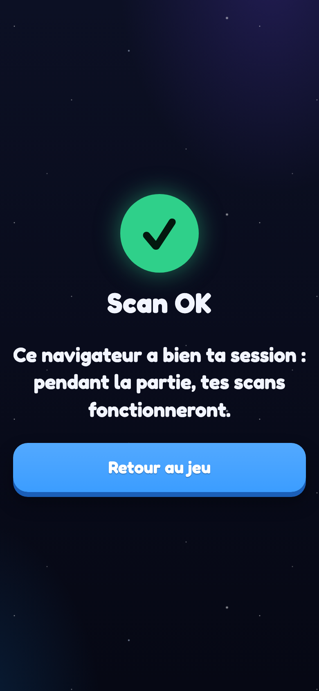
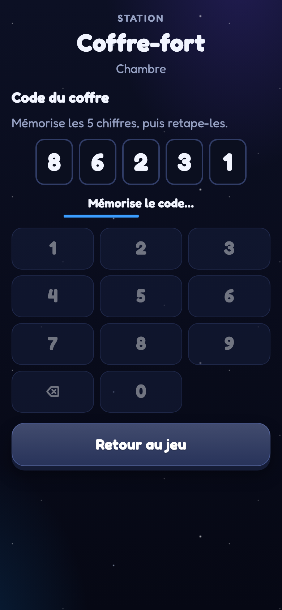
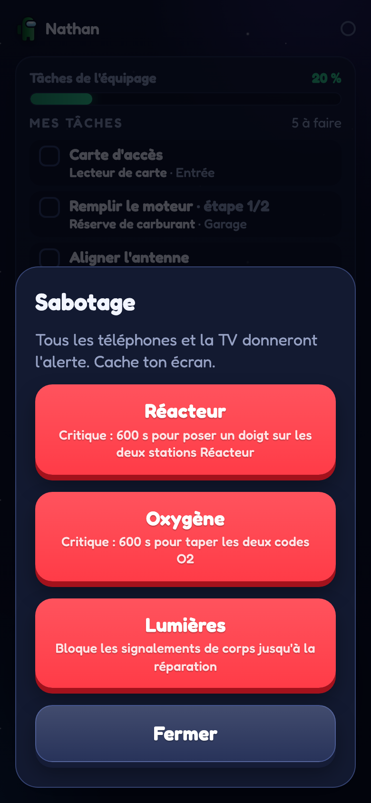
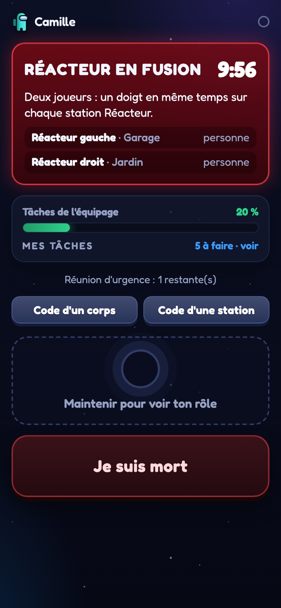
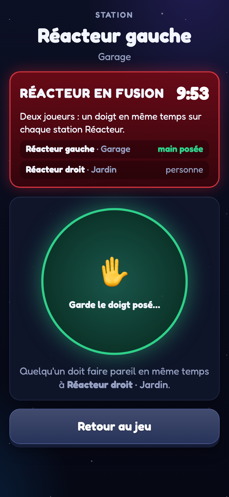
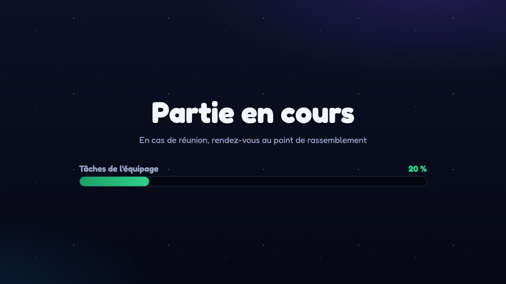
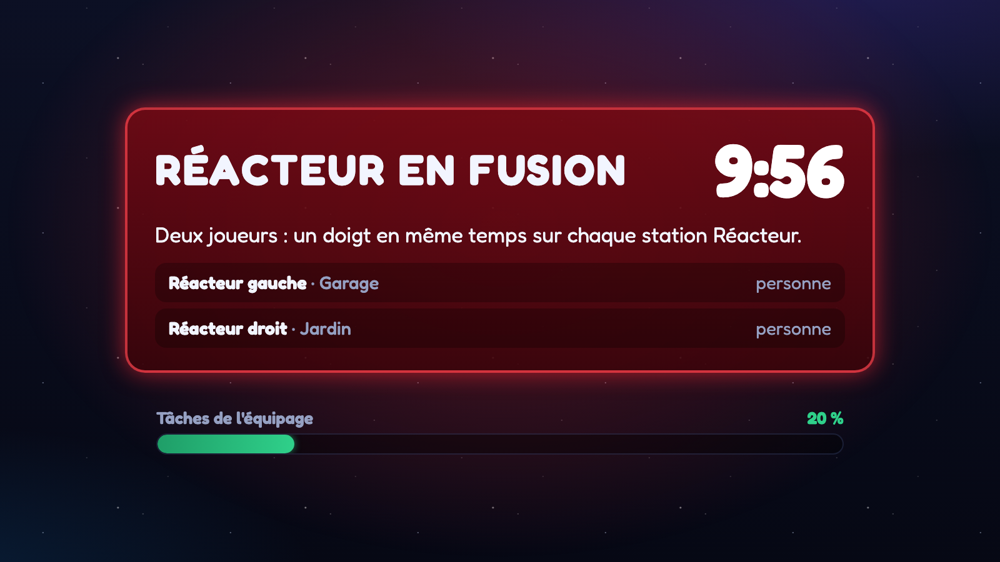
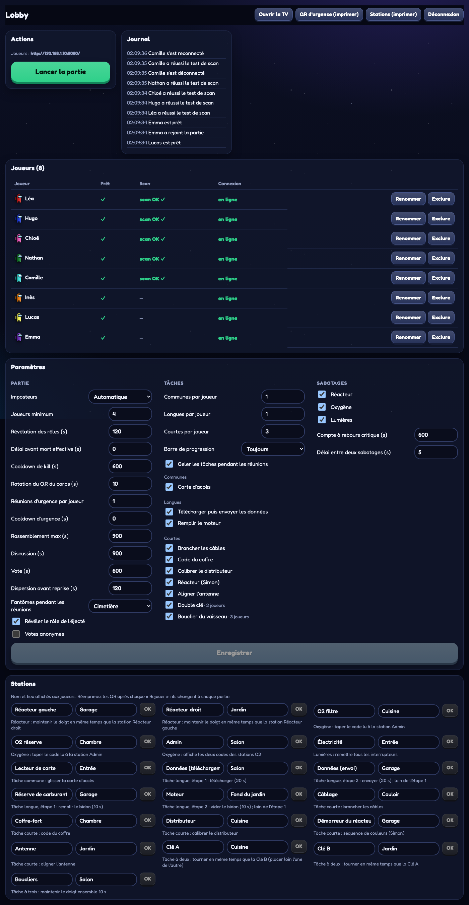

# Among Us IRL

Arbitre numérique pour jouer à Among Us en vrai, dans une maison ou un jardin. Chaque joueur utilise son smartphone comme terminal, directement dans le navigateur, sans rien installer. Le serveur tourne sur un mini-PC ou un Raspberry Pi, sur un Wi-Fi local sans accès à internet.

- **Joueurs** : `/` sur le téléphone (lobby, rôle secret, tâches, « Je suis mort », corps en QR code, réunions, vote).
- **Écran partagé** : `/tv` sur une TV ou un vidéoprojecteur.
- **Maître du jeu** : `/admin` sur un ordinateur ou une tablette, protégé par un code. Le MJ voit tous les rôles et ne joue pas.

Des **stations** imprimées (QR codes) sont réparties dans la maison : les joueurs y font leurs **tâches** sur le téléphone (mini-jeux) et y réparent les **sabotages** des imposteurs (réacteur, oxygène, lumières).

La référence complète des règles et du fonctionnement est dans [SPEC.md](SPEC.md).

## Aperçu

### Sur le téléphone

| Rejoindre | Entraînement au scan | Lobby et consignes |
|:-:|:-:|:-:|
|  |  |  |

| Rôle secret (maintenir) | En jeu : mes tâches | Une tâche à sa station |
|:-:|:-:|:-:|
|  |  |  |

| Menu de sabotage caché | Sabotage en cours | Réparer le réacteur |
|:-:|:-:|:-:|
|  |  |  |

| Mort : le téléphone devient le corps | Corps signalé | Rassemblement |
|:-:|:-:|:-:|
|  |  |  |

| Vote | Résultat | Victoire |
|:-:|:-:|:-:|
|  |  |  |

### Sur la TV

| Lobby (avec le QR d'essai) | Révélation des rôles |
|:-:|:-:|
|  |  |

| Partie en cours : barre des tâches | Sabotage du réacteur |
|:-:|:-:|
|  |  |

| Alarme | Discussion |
|:-:|:-:|
|  |  |

| Vote | Éjection |
|:-:|:-:|
|  |  |

<p align="center"></p>

### Console du maître du jeu

| Lobby : paramètres, tâches, sabotages, stations | En jeu : joueurs, sabotage, tâches |
|:-:|:-:|
|  |  |

## Préparer la soirée

### Matériel

- Un Raspberry Pi 5 ou un mini-PC avec Docker, branché sur le routeur Wi-Fi de la soirée.
- Un routeur Wi-Fi local. Internet n'est pas nécessaire pendant la partie.
- Une TV ou un vidéoprojecteur relié à un navigateur (ordinateur, clé HDMI…).
- Une imprimante pour le QR code de la station d'urgence et les QR codes des stations (tâches et sabotages).
- Un téléphone chargé par joueur, avec un navigateur récent.

### Installation (à faire chez soi, avec internet)

La première construction de l'image télécharge Node.js et les dépendances.

1. Récupérez le dépôt sur le Pi.
2. Copiez le fichier d'environnement :

   ```bash
   cp .env.example .env
   ```

3. Éditez `.env` :
   - `PUBLIC_URL` : l'adresse du Pi sur le Wi-Fi de la soirée, par exemple `http://192.168.1.10:8080`. Tous les QR codes pointent vers cette adresse : réservez une IP fixe au Pi dans le routeur.
   - `ADMIN_PIN` : le code de la console MJ.
4. Construisez et démarrez :

   ```bash
   docker compose up -d --build
   ```

5. Vérifiez que le serveur répond :

   ```bash
   curl http://localhost:8080/api/health
   ```

La partie est enregistrée dans `./data` (SQLite). Si le Pi redémarre, la partie reprend où elle en était, et les joueurs sont reconnectés automatiquement.

### Le jour J

1. Ouvrez `/tv` sur l'écran partagé et cliquez une fois pour activer le son.
2. Ouvrez `/admin` et entrez le code. Réglez les paramètres : durées, nombre d'imposteurs, mode des fantômes, tâches (lesquelles, combien par joueur, visibilité de la barre de progression) et sabotages (lesquels, compte à rebours, délai entre deux sabotages).
3. Dans le panneau **Stations**, donnez à chaque station un nom et un lieu (ex. « Moteur », « Jardin ») : les joueurs les voient dans leur liste de tâches. Éloignez les deux étapes des tâches longues, les deux stations Réacteur, les deux stations O2 et les deux Clés.
4. Imprimez **QR d'urgence (imprimer)** et **Stations (imprimer)**, puis collez chaque page à sa place. Ces QR codes ne sont valables que pour la partie en cours : réimprimez-les après chaque « Rejouer ».
5. Les joueurs scannent le QR code de la TV, choisissent un pseudo et une couleur, puis touchent **Je suis prêt**. Ce bouton active le son, teste la vibration et garde l'écran allumé.
6. **Entraînement au scan** : chaque joueur scanne le petit QR d'essai affiché sur la TV avec l'appareil photo de son téléphone. « Scan OK » s'affiche sur son téléphone, sur la TV et dans la console : l'appareil photo ouvre bien le jeu. Sinon, la page conseille de rejoindre la partie avec le navigateur par défaut du téléphone.
7. Lancez la partie depuis la console.

### Rappel des règles physiques

- **Tuer** : l'imposteur pose deux doigts sur l'épaule de la victime en chuchotant « tu es mort ». Il ne touche jamais son téléphone à ce moment-là.
- **Mourir** : la victime maintient **Je suis mort** 1,5 s. Après un court délai, son téléphone affiche un QR code : c'est son corps. Elle reste sur place, écran visible, sans parler.
- **Signaler** : un joueur vivant scanne le corps avec l'**appareil photo** de son téléphone. Il faut ouvrir le lien dans le navigateur qui a servi à rejoindre la partie. Si l'appareil photo ouvre un autre navigateur, le joueur touche **Code d'un corps** dans le jeu et tape les 4 chiffres affichés sous le QR du corps (le code change avec le QR ; 5 erreurs bloquent 30 s).
- **Réunion d'urgence** : scanner le QR code imprimé de la station.
- **Tâches** : chaque joueur a sa liste (par défaut 1 commune, 1 longue, 3 courtes). Il scanne la station indiquée (ou tape le code imprimé dessous avec **Code d'une station**) et fait le mini-jeu sur son téléphone. Les imposteurs ont une fausse liste qui ne fait pas avancer la barre ; les fantômes continuent leurs tâches. Quand la barre est pleine, les équipiers gagnent.
- **Sabotages** : un imposteur maintient la zone « Maintenir pour voir ton rôle », glisse le doigt sur « saboter » et relâche. Tous les téléphones et la TV donnent l'alerte :
  - **Réacteur** : deux joueurs posent le doigt en même temps sur les deux stations Réacteur ;
  - **Oxygène** : lire les deux codes à la station Admin, puis les taper aux deux stations O2 ;
  - **Lumières** : remettre les interrupteurs à la station Électricité ; en attendant, impossible de signaler un corps.

  Réacteur et oxygène non réparés à temps : victoire des imposteurs. Pendant ces deux sabotages, le bouton d'urgence est bloqué ; toute réunion annule le sabotage.
- **Fantômes** : ils ne parlent jamais aux vivants.

### Conseils

- Luminosité au maximum et verrouillage automatique désactivé sur tous les téléphones.
- Rejoignez la partie avec le navigateur par défaut du téléphone (Safari sur iPhone) : c'est lui qu'ouvre l'appareil photo. N'ajoutez pas le jeu à l'écran d'accueil, la session n'y serait pas partagée.
- Sur iPhone, la vibration n'existe pas dans le navigateur : l'écran affiche toujours un signal visuel.
- Si un téléphone s'éteint ou se recharge, il suffit de rouvrir la page : la session est conservée. Un bandeau demande de toucher l'écran pour réactiver le son et l'écran allumé.
- En cas de problème, le MJ peut tout rattraper depuis la console : signaler un corps à la place d'un joueur, tuer ou réanimer, passer à la phase suivante, réparer un sabotage, valider une tâche à la main, terminer la partie ou l'annuler pour revenir au lobby.
- Les joueurs hors ligne sont signalés sur la TV et dans les listes : un téléphone éteint bloque le rassemblement jusqu'au délai maximum, le MJ peut passer à la suite.

## Développement

Prérequis : Node.js 22 ou plus récent, et pnpm (`corepack enable pnpm`).

```bash
pnpm install
pnpm dev          # serveur (port 8080) + Vite (port 5173) avec rechargement à chaud
pnpm test         # tests Vitest (moteur, jetons, intégration réseau, redémarrage)
pnpm typecheck
pnpm build        # build de production (web + serveur)
pnpm start        # lance le build de production
```

Tester sans téléphones :

```bash
pnpm simulate --players 8              # des bots jouent une partie complète (kills, sabotage, votes)
pnpm simulate --players 4 --passive    # des bots attendent ; vous pilotez depuis /admin
```

Dans les deux modes, les bots vivants réparent les sabotages et les bots font une étape de tâche toutes les 20 secondes (`--task-every 5` pour accélérer, `--task-every 0` pour les arrêter).

- Ajoutez `?dev=1` à l'URL joueur pour ouvrir plusieurs joueurs dans les onglets d'un même navigateur.
- `TIME_SCALE=0.2` accélère toutes les durées (développement uniquement).
- `pnpm screenshots` régénère les captures de ce README. Il faut d'abord lancer `pnpm build`, et Google Chrome doit être installé.

La CI GitHub (`.github/workflows/ci.yml`) vérifie les types, les tests, le build, et construit l'image Docker pour amd64 et arm64 (Raspberry Pi). Sur `main`, elle publie aussi l'image sur GitHub Container Registry (`ghcr.io/<owner>/<repo>:latest`).

### Déploiement sur un NAS (image prébuilt)

1. Sur le NAS, récupérez `docker-compose.nas.yml` et `.env.example` (renommé en `.env`) dans un même dossier.
2. Éditez `.env` : `PUBLIC_URL` (IP fixe du NAS, port 8080), `ADMIN_PIN` et `GITHUB_REPOSITORY` (`owner/repo` en minuscules).
3. Si le dépôt est privé, connectez-vous une fois : `docker login ghcr.io` (identifiant GitHub + token avec le droit `read:packages`). Sinon, rendez le paquet public dans GitHub > Packages.
4. Lancez, puis mettez à jour à chaque nouvelle version :

   ```bash
   docker compose -f docker-compose.nas.yml pull
   docker compose -f docker-compose.nas.yml up -d
   ```


L'architecture (moteur de jeu pur, minuteurs dérivés de l'état, vues filtrées par client) est décrite dans [CLAUDE.md](CLAUDE.md).

### Variables d'environnement

| Variable | Rôle | Défaut |
|---|---|---|
| `PORT` | Port HTTP | `8080` |
| `PUBLIC_URL` | URL encodée dans les QR codes | obligatoire en production |
| `ADMIN_PIN` | Code de la console MJ | obligatoire en production (`1234` en dev) |
| `HMAC_SECRET` | Secret de signature des QR codes | généré dans `DATA_DIR` |
| `DATA_DIR` | Répertoire de la base SQLite | `/app/data` (Docker), `./data` (dev) |
| `TIME_SCALE` | Accélérateur de durées, dev uniquement | `1` |
